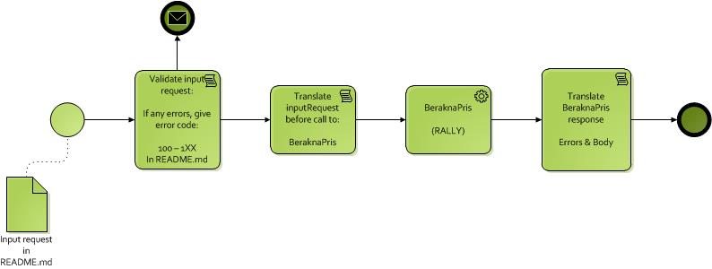

# business.agreement.createagreement

1.0.0-SNAPSHOT
## Stories

### Story: Create agreement
    
#### Scenario: General information
    Given a correct <userId>
    When an agreement is created for a correct <ownerId>
    Then the agreement should be created and the <agreementId> returned
    
##### Examples:
<table>
<tr>
<th>userId</th>
<th>ownerId</th>
<th>agreementId</th>
</tr>
<tr>
<td>b28adm</td>
<td>196504192730</td>
<td>1</td>
</tr>
<tr>
<td>b28adm</td>
<td>198010101234</td>
<td>2</td>
</tr>
</table>

## Request
    Request {
        customerIds (Set[String], required) : "CustomerIds for the owners of this agreement, i.e. organization or personal number."
    }
    

## Response
	Response {
		id (null),
		response ({
			agreementId (Number, required) : "The agreement id for the created agreement."
		}, optional),
		errors (Array[Error], optional)
	}

	Error {
		errorCode (Number) = [
			10: Access denied |
			11: System error |
			100: The customer is locked by another user |
			200: The number of agreement owners must be greater than zero |
			201: All supplied customerIds are not valid |
		]
		errorMessage (String)
	}

## Business Service dependencies
* [business.agreement.createbranchusersession/1.0.0-SNAPSHOT](../../business.agreement.createbranchusersession/1.0.0-SNAPSHOT/)
* [business.agreement.deletebranchusersession/1.0.0-SNAPSHOT](../../business.agreement.deletebranchusersession/1.0.0-SNAPSHOT/)

## Integration Service dependencies
* integration.agreement.createagreement/1.0.0-SNAPSHOT

## Flow
